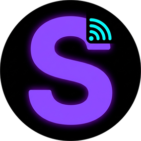

  <h1>Stelix</h1> 
<b>Всё для стрима — в одном приложении</b>
 
 <a href="https://stelix.stream/">Сайт</a> · <a href="../../releases/latest">Скачать</a> 
 

Stelix — десктопное приложение для стримеров под Windows. Оно собирает чат, события, музыку, таймеры и субтитры в одном окне и выводит всё это в OBS готовыми виджетами. Ничего не нужно настраивать через сторонние сервисы: виджеты раздаются локально и обновляются мгновенно.

Возможности

💬 Единый чат — Twitch и YouTube в одной ленте и в оверлее для OBS.

🟣 События Twitch — фолловеры, сабы, рейды и награды за баллы канала.

🔔 Кастомные алерты — свои оповещения на события и награды.

🎵 Музыка — текущий трек из Windows (название, исполнитель, обложка) и виджет «Сейчас играет».

🎙️ Субтитры — распознавание речи и перевод в реальном времени прямо на стрим.

⏱️ Таймеры — обратный отсчёт, секундомер, отсчёт до времени и Pomodoro со счётчиком циклов.

🔄 Автообновление — новые версии ставятся прямо из приложения.

Установка
Скачайте Stelix_x.y.z_x64-setup.exe со страницы последнего релиза.
Запустите установщик.
Добавьте нужные виджеты в OBS как «Браузер» по ссылкам из приложения.
Требуется Windows 10 или 11 (x64).

Поддержка
Новости, инструкции и обратная связь — на stelix.stream.

 
<b>English</b>

Stelix is a Windows desktop companion for streamers. It brings chat, events, music, timers and live subtitles into one app and serves them to OBS as ready-made widgets, locally and in real time.

Features: unified Twitch + YouTube chat, Twitch events and channel point rewards, custom alerts, "Now playing" music widget, speech-to-text subtitles with translation, timers (countdown, stopwatch, Pomodoro), built-in auto-updates.

Install: download the latest *-setup.exe from Releases and run it. Windows 10/11 x64.

More at stelix.stream.

